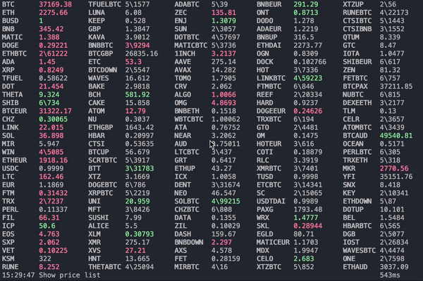
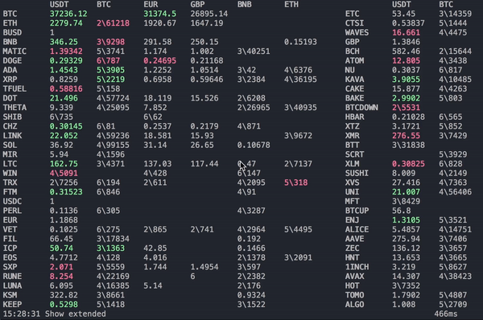
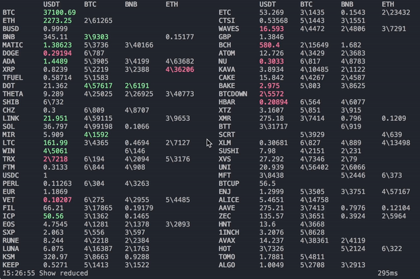
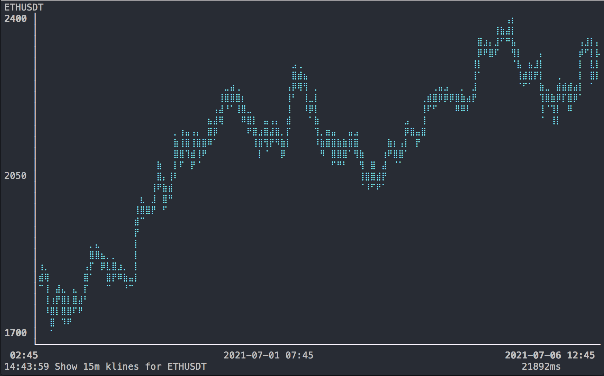

# coinlive

Coinlive is a command line tool that displays live cryptocurrency prices. It can also display simple historical price charts.

The data is provided by the [Binance](binance.com) [Spot API](https://binance-docs.github.io/apidocs/spot/en/). The CLI is written in [Rust](https://www.rust-lang.org/) and relies heavily on the superb [tui](https://docs.rs/tui/0.15.0/tui/) library.

## Installation

1. Install Rust. If you don't already have Rust installed, follow the instructions on [rustup.rs](https://rustup.rs/).
2. Clone the `coinlive` repository and `cd coinlive`
3. Issue `RUSTFLAGS='-C target-cpu=native -C opt-level=3' cargo build --release` or just `make release`. The generated executable is `target/release/coinlive`.

## Usage

### Prices List

The price list page is the default page, it shows cryptocurrency prices updated in 1s intervals.

The cryptocurrency symbols are sorted by trading volume. When the quote currency is missing `USDT` is implied, for example `BTC` stands for `BTCUSDT` and `ETH` stands for `ETHUSDT`.

This is the default page. It can also be reached at any time by pressing `l`.

#### Compact notation for small prices

Some currency pairs have very small prices, e.g `SHIBUSDT` at 0.000000734. These small numbers are difficult to read (how many zeros are there?) and take a lot of screen real estate. Therefore, a compact notation was adopted. For example, 0.000000734 is shown as 6\734, meaning there are 6 zeros after the decimal point before the first non-zero digit. Here are some examples:

- **2**\61226 is 0.**00**61226
- **3**\31772 is 0.**000**31772
- **4**\871 is 0.**0000**871
- **5**\1557 is 0.**00000**1557

### Prices Table

Prices are displayed in a grid. Vertically the base currency is shown, and horizontally the quote currency. For example, BTCUSDT has base currency BTC and quote currency USDT, and a price of 37000 means that 1 BTC is worth 37000 USDT. Only the active markets are shown.

The price table can be reached by pressing `t`. By default the quote currencies shown are `USDT`, `BTC`, `EUR`, `GBP`, `BNB`, `ETH`, this is called the extended view. There is also a reduced view that only shows  `USDT`, `BTC`, `BNB`, `ETH`. Toggle between extended and reduced view by pressing `x` ("extended").

### Percentages

Prices list and prices table can also show the 24h percentage change. Press `%` to toggle between price and percentage view.

### Historical Price Chart

The historical price chart is shown when pressing `g` or a number `0`...`9`. `g` and `0` show the last 1000 one-minute closing prices.

The time scales can be selected with the keys `0`...`9` as follows:

- `0` 1m

- `1` 5m

- `2` 15m

- `3` 30m

- `4` 1h

- `5` 2h

- `6` 4h

- `7` 8h

- `8` 12h

- `9` 1d

By default the most liquid currency pair (usually BTCUSDT) is shown. To select another currency pair, press `s`. Hihlight the desired pair by moving the cursor, after pressing return the price chartfor the selected pair is shown.

### Help

Press `h` to see the help page.

## Todo
- Use `Decimal64` in Graph page instead of `f64`
- Live update price chart, or at least show price update in the message bar?
- Some currency information, such as market cap, would be nice. [Coincap](coincap.io) has an open [API](https://docs.coincap.io/).

